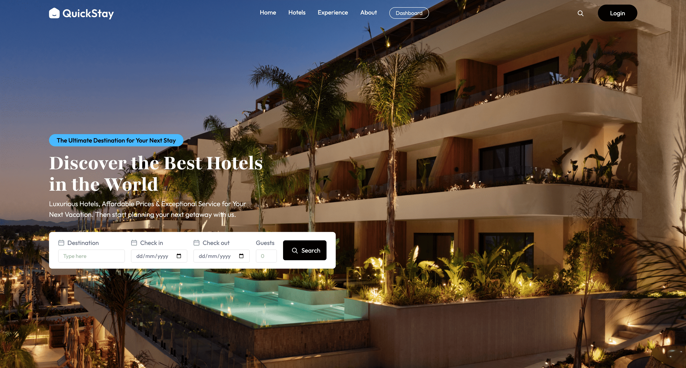

# 🏨 Hotel Booking System

Full-stack hotel booking application built with MERN stack featuring admin dashboard for managing hotels, rooms, and bookings.

## 🛠️ Tech Stack

**Frontend:** React 19.1, React Router, TailwindCSS 4.1, Vite  
**Backend:** Node.js, Express.js, MongoDB, Mongoose (Coming Soon)

## ✨ Features

### User Side

- 🔍 Search hotels by destination, dates, and guests
- 🏨 Browse hotels and rooms with detailed info
- 💳 Secure booking system
- 👤 User authentication
- 📱 Fully responsive design

### Admin Dashboard

- 📊 Analytics and statistics
- 🏢 Hotel & room management
- 📋 Booking tracking
- 💰 Revenue reports

## 📸 Screenshots




## 🚀 Quick Start

### Installation

```bash
# Clone repository
git clone https://github.com/yasin-erkan/Hotel-Booking-System.git
cd Hotel-Booking-System

# Install frontend dependencies
cd client
npm install
npm run dev
```

Frontend runs at `http://localhost:5173`

### Environment Variables

Create `.env` in client folder:

```env
VITE_API_URL=http://localhost:5000/api
```

## 📁 Project Structure

```
hotel-booking/
├── client/              # React frontend
│   ├── src/
│   │   ├── components/  # Navbar, Hero, etc.
│   │   ├── pages/       # Home, Hotels, etc.
│   │   └── assets/      # Images & icons
└── server/              # Express backend (Coming Soon)
    ├── models/
    ├── routes/
    └── controllers/
```

## 🎯 Implementation Status

### ✅ Completed (Frontend)

- [x] Project setup with Vite + React
- [x] Responsive Navbar with scroll effects
- [x] Hero section with search form
- [x] TailwindCSS integration
- [x] Mobile-responsive design
- [x] Routing setup

### 🚧 In Progress

- [ ] Hotel listing page
- [ ] Hotel details page
- [ ] Booking page
- [ ] User authentication UI

### 📋 To Do (Backend)

- [ ] Express server setup
- [ ] MongoDB database schema
- [ ] REST API endpoints
- [ ] JWT authentication
- [ ] Admin dashboard backend
- [ ] Payment integration
- [ ] Email notifications

## 🤝 Contributing

Contributions are welcome! Please follow these steps:

1. Fork the repository
2. Create your feature branch (`git checkout -b feature/AmazingFeature`)
3. Commit your changes (`git commit -m 'Add some AmazingFeature'`)
4. Push to the branch (`git push origin feature/AmazingFeature`)
5. Open a Pull Request

## 📜 License

This project is licensed under the MIT License - see the [LICENSE](LICENSE) file for details.

## 👨‍💻 Author

**Yasin Erkan**  
College Project - Full Stack MERN Hotel Booking Application

GitHub: [@yasin-erkan](https://github.com/yasin-erkan)  
Repository: [Hotel-Booking-System](https://github.com/yasin-erkan/Hotel-Booking-System)

---

⭐ Star this repo if you find it helpful!
